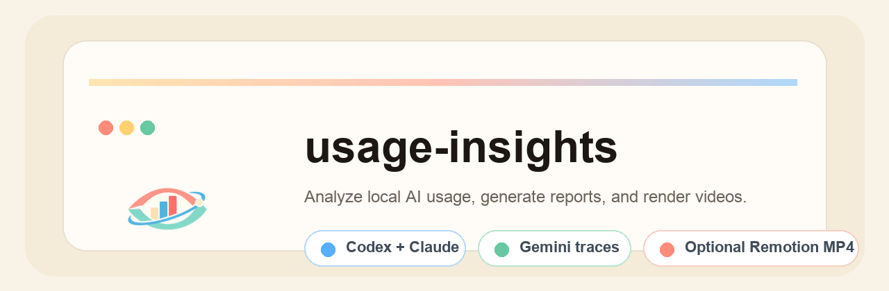

<p align="center">
  
</p>

<p align="center">
  <a href="./README.md"><strong>English</strong></a>
  ·
  <a href="./README.ko.md"><strong>한국어</strong></a>
</p>

`usage-insights`는 로컬 AI 사용 기록을 분석해서 리포트와 선택형 Remotion 영상을 만드는 공개 Codex 스킬입니다.

## 예시 출력


## 할 수 있는 것

- Codex와 Claude의 로컬 토큰 기록 집계
- Gemini와 Antigravity의 활동 흔적 수집
- 프로젝트 비중, 작업 리듬, 사용 습관, 해석 리포트 생성
- 같은 데이터를 기반으로 포스터와 MP4 렌더

## 설치

설치 경로:

`aldegad/usage-insights/usage-insights`

설치 후 예시 프롬프트:

- `Use $usage-insights to analyze my local AI usage and write a report.`
- `Use $usage-insights to make a shareable AI usage profile and render a video.`

## 빠른 시작

```bash
python3 usage-insights/scripts/create_project.py --dest ~/usage-insights-project --install
cd ~/usage-insights-project
npm run analyze
npm run dev
npm run render:poster
npm run render:video
```

## 공개 저장소로 올려도 되나

스킬 저장소 자체는 괜찮습니다. 이 저장소에는 일반화된 코드, 문서, 템플릿, 예시 데이터만 들어 있습니다.

하지만 실제 생성물은 검토가 필요합니다.

- `INSIGHTS.md`
- `src/data/usage-insights.generated.ts`
- 렌더된 포스터와 MP4

이 파일들에는 프로젝트 이름, 사용 기간, 작업 습관, 사용량 정보가 포함될 수 있습니다. 포트폴리오 용도로 공개하려면 민감한 프로젝트명과 날짜는 한 번 더 정리하는 편이 안전합니다.

## 데이터 커버리지

- `Codex`: 토큰 기반 집계 가능
- `Claude`: 로컬 raw 로그가 있으면 토큰 기반 집계 가능
- `Gemini`: 현재는 활동 흔적과 프로젝트 라벨 중심
- `Antigravity`: 현재는 활동 흔적 중심

즉 Gemini와 Antigravity는 지금 기준으로 `사용한 프로젝트/활동 흔적`은 잡되, `토큰 총합`은 근거가 없으면 억지로 합산하지 않습니다.

## 영상도 뽑아주나

됩니다. 템플릿 워크스페이스를 만든 뒤 다음 순서로 진행하면 됩니다.

1. `npm install`
2. `npm run analyze`
3. `npm run dev`
4. `npm run render:poster`
5. `npm run render:video`

## 라이선스

MIT
